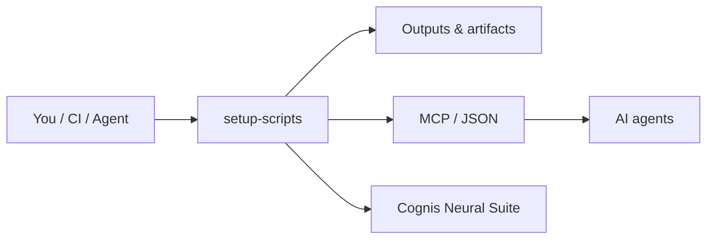

# cognis-setup-scripts

> Curated, **idempotent** Ubuntu/Debian setup scripts for popular dev & infra tools.

A collection of small, focused Bash scripts that install and configure common developer and infrastructure tools. Every script is **safe to run repeatedly** — if a tool is already present (and the right version), the script detects it and skips reinstalling.

## Design principles

- **Idempotent** — re-running a script never corrupts state and is a near no-op when already installed.
- **Strict Bash** — every script starts with `set -euo pipefail`.
- **No surprises** — scripts only touch what they advertise in their header comment.
- **Pinned where it matters** — versions live in env vars at the top of each script so you can override them: `TERRAFORM_VERSION=1.8.5 ./scripts/terraform.sh`.
- **Non-interactive** — suitable for CI, cloud-init, and Dockerfiles.

## Requirements

- Ubuntu 20.04+ / Debian 11+ (uses `apt-get`).
- `sudo` privileges (or run as root in a container).
- `curl` and `ca-certificates` (the scripts install these if missing).

## Quick start

One-liner installer (dispatches to a named script in `scripts/`):

```bash
curl -fsSL https://raw.githubusercontent.com/cognis-digital/cognis-setup-scripts/main/install.sh | bash -s -- docker
```

Or clone and run directly:

```bash
git clone https://github.com/cognis-digital/cognis-setup-scripts.git
cd cognis-setup-scripts
./install.sh docker node rust
```

Install a sensible default developer stack in one shot:

```bash
./bootstrap-dev.sh
```

## Available scripts

| Tool | Script | Installs | Verify |
|------|--------|----------|--------|
| Docker Engine | `scripts/docker.sh` | Docker CE + buildx + compose plugin | `docker --version` |
| Docker Compose | `scripts/docker-compose.sh` | Standalone `docker-compose` v2 binary | `docker-compose --version` |
| Node.js (nvm) | `scripts/node.sh` | nvm + Node LTS + corepack | `node --version` |
| Python (pyenv) | `scripts/python.sh` | pyenv + a pinned CPython + build deps | `python --version` |
| Go | `scripts/go.sh` | Official Go toolchain to `/usr/local/go` | `go version` |
| Rust | `scripts/rust.sh` | rustup + stable toolchain | `rustc --version` |
| kubectl + Helm | `scripts/kubectl-helm.sh` | kubectl + helm 3 | `kubectl version --client` |
| Terraform | `scripts/terraform.sh` | HashiCorp apt repo + terraform | `terraform version` |
| PostgreSQL | `scripts/postgres.sh` | PGDG repo + server + client | `psql --version` |
| Redis | `scripts/redis.sh` | redis-server + redis-cli | `redis-cli --version` |
| Nginx | `scripts/nginx.sh` | nginx + enabled service | `nginx -v` |
| Tailscale | `scripts/tailscale.sh` | tailscaled daemon + CLI | `tailscale version` |
| Ollama | `scripts/ollama.sh` | Ollama runtime + systemd service | `ollama --version` |
| GitHub CLI | `scripts/gh-cli.sh` | `gh` from the official apt repo | `gh --version` |
| AWS CLI v2 | `scripts/awscli.sh` | aws-cli v2 (official bundle) | `aws --version` |

## Overriding versions

Most scripts read a `*_VERSION` environment variable. For example:

```bash
GO_VERSION=1.22.4 ./scripts/go.sh
NODE_VERSION=20 ./scripts/node.sh
TERRAFORM_VERSION=1.8.5 ./scripts/terraform.sh
```

## Bootstrap stack

`bootstrap-dev.sh` installs: build essentials, git, Docker, Node (LTS), Python (pyenv), Go, Rust, and the GitHub CLI. Customize the list near the top of the file.

## Conventions for shell init

Scripts that need shell environment (nvm, pyenv, rust, go) append idempotent blocks to `~/.bashrc` guarded by markers so they are never duplicated. Open a new shell or `source ~/.bashrc` afterward.

## How it fits



**Explore the suite →** [🗂️ all tools](https://github.com/cognis-digital/cognis-neural-suite) · [⭐ awesome-cognis](https://github.com/cognis-digital/awesome-cognis) · [🔗 cognis-sources](https://github.com/cognis-digital/cognis-sources)

## License

MIT — see [LICENSE](LICENSE).

---

Maintained by **Cognis Digital LLC**.
